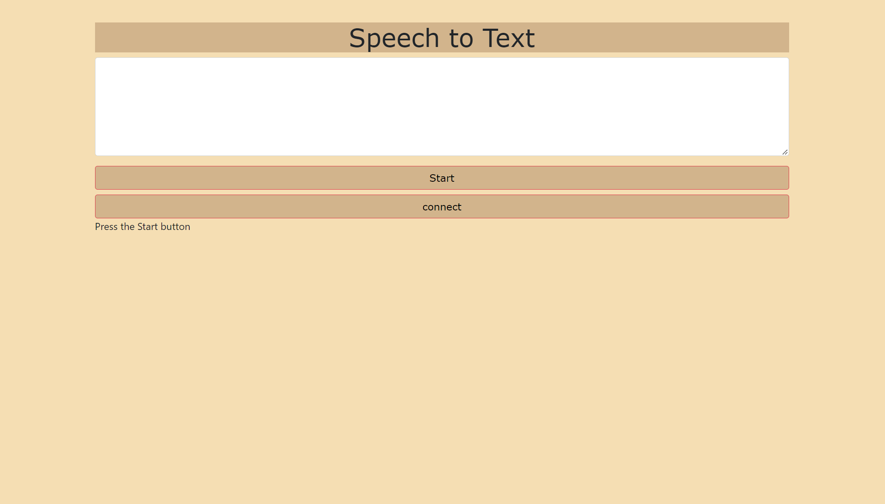

# Robot-Arm-Control🦾

## Internet of things task🗣: 
**○ Web Page Programming for Arm Control Using web serial API**  
**○ Writing Arduino Code for Control** 
 
## What is a Web Serial API❓
### The Web Serial API provides a way for websites to read from and write to serial devices. These devices may be connected via a serial port, or be USB or Bluetooth devices that emulate a serial port.

## Web Page view🌐: 

**Here when you click on a connect it will show a small window to choose the right port that connects to the Arduino board, then you can click on a start and say the direction you want**  

  
## Implemented using 🛠️: 
○ **HTML** 
○ **JS** 
○ **Arduino** 

## Resources 🔗: 
https://web.dev/serial/ 
